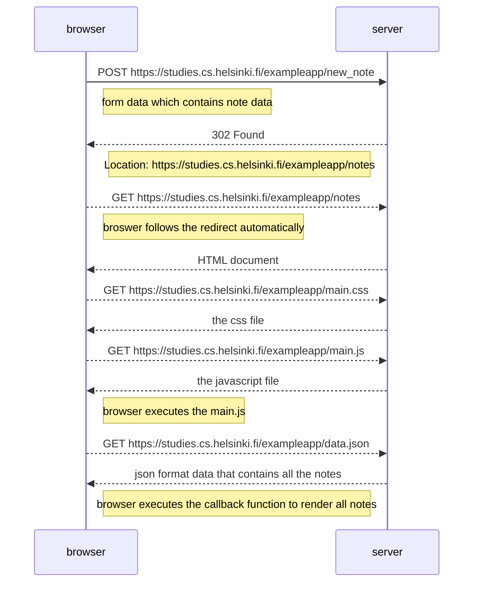

```mermaid
sequenceDiagram
    participant browser
    participant server

    browser->>server: POST https://studies.cs.helsinki.fi/exampleapp/new_note
    note right of browser : form data which contains note data
    server-->>browser: 302 Found
    note left of server :Location: https://studies.cs.helsinki.fi/exampleapp/notes
    browser -->> server:GET https://studies.cs.helsinki.fi/exampleapp/notes
    note right of browser : broswer follows the redirect automatically
    server-->> browser : HTML document
    browser -->> server : GET https://studies.cs.helsinki.fi/exampleapp/main.css
    server -->> browser : the css file
    browser -->> server : GET https://studies.cs.helsinki.fi/exampleapp/main.js
    server -->> browser : the javascript file
    note right of browser :   browser executes the main.js
    browser -->>server :GET https://studies.cs.helsinki.fi/exampleapp/data.json
    server -->> browser : json format data that contains all the notes
    note right of browser : browser executes the callback function to render all notes


```
